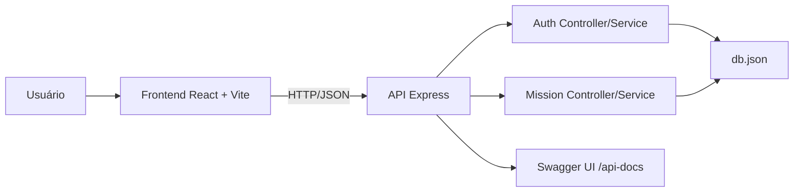

# Arquitetura da Aplicação

## Visão geral

O **Forja de Heróis** segue uma arquitetura fullstack separada por responsabilidades:

- `frontend/`: aplicação React responsável pela experiência do usuário.
- `backend/`: API REST responsável por autenticação, regras de negócio, persistência e documentação Swagger.

---

## Diagrama lógico



---

## Estrutura de diretórios

```text
Forja de Heróis
├── backend/
│   ├── src/
│   │   ├── app.js
│   │   ├── index.js
│   │   ├── controllers/
│   │   ├── routes/
│   │   ├── services/
│   │   ├── middlewares/
│   │   ├── models/
│   │   ├── data/
│   │   └── utils/
│   ├── tests/
│   └── k6/
├── frontend/
│   ├── src/
│   │   ├── components/
│   │   ├── pages/
│   │   ├── routes/
│   │   └── services/
│   └── cypress/
└── README.md
```

---

## Backend

| Camada | Responsabilidade |
| --- | --- |
| `routes/` | Define endpoints HTTP |
| `controllers/` | Recebe requisições e monta respostas |
| `services/` | Centraliza regras de negócio |
| `middlewares/` | Valida autenticação JWT |
| `models/localDb.js` | Lê e grava dados no arquivo JSON local |
| `utils/swagger.js` | Configura documentação Swagger |

### Principais arquivos

| Arquivo | Papel |
| --- | --- |
| `backend/src/app.js` | Configura Express, CORS, JSON, rotas e Swagger |
| `backend/src/index.js` | Inicializa o servidor |
| `backend/src/services/authService.js` | Registro, login, hash de senha e emissão de JWT |
| `backend/src/services/missionService.js` | Missões, transições de status, XP e nível |
| `backend/src/middlewares/authMiddleware.js` | Validação do token Bearer |

---

## Frontend

| Camada | Responsabilidade |
| --- | --- |
| `pages/` | Telas principais, como login, home e dashboard |
| `components/` | Componentes reutilizáveis da interface |
| `routes/` | Configuração de navegação |
| `services/` | Clientes HTTP para autenticação e missões |

### Comunicação com API

O arquivo `frontend/src/services/api.js` cria uma instância Axios com:

- `baseURL`: `http://localhost:4000`
- `Content-Type`: `application/json`
- Interceptor para enviar `Authorization: Bearer <token>` quando houver token no `localStorage`.

---

## Persistência

O estado atual usa um arquivo JSON local:

```text
backend/src/data/db.json
```

### Estrutura conceitual

| Entidade | Campos principais |
| --- | --- |
| Usuário | `id`, `name`, `email`, `password`, `xp`, `level` |
| Missão | `id`, `title`, `difficulty`, `xp`, `status`, `userId` |

>  **Atenção:** a persistência em JSON é adequada para desenvolvimento local e demonstração, mas não é recomendada para produção. A evolução natural é migrar para Prisma + SQLite ou outro banco relacional.

---

## Segurança

| Mecanismo | Implementação |
| --- | --- |
| Hash de senha | `bcryptjs` |
| Sessão | JWT com validade de 8 horas |
| Rotas protegidas | Middleware `authMiddleware` |
| Isolamento de dados | Missões são filtradas por `userId` |
| CORS | Habilitado no Express |

---

## Páginas relacionadas

- [API e Swagger](API-e-Swagger)
- [Regras de Negócio](Regras-de-Negocio)
- [Guia de Instalação e Execução](Guia-de-Instalacao-e-Execucao)

