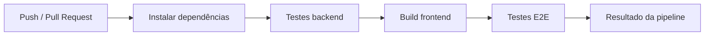

# 🚀 CI/CD e Ambientes

## 📌 Visão geral

O projeto prevê automação com **GitHub Actions** para validar qualidade a cada alteração. A pipeline deve proteger o repositório contra regressões em backend, frontend e testes críticos.

---

## 🌎 Ambientes

| Ambiente | URL padrão | Finalidade |
| --- | --- | --- |
| Local - Backend | `http://localhost:4000` | Desenvolvimento e testes da API |
| Local - Frontend | `http://localhost:3000` | Desenvolvimento e validação visual |
| Local - Swagger | `http://localhost:4000/api-docs` | Consulta interativa da API |
| CI | GitHub Actions | Validação automatizada |
| Produção | A definir | Deploy público futuro |

---

## 🔐 Variáveis esperadas

| Variável | Ambiente | Descrição |
| --- | --- | --- |
| `PORT` | Backend | Porta HTTP da API |
| `JWT_SECRET` | Backend/CI | Chave de assinatura JWT |

---

## ✅ Pipeline recomendada



---

## 🧪 Etapas sugeridas

| Etapa | Diretório | Comando |
| --- | --- | --- |
| Instalar backend | `backend/` | `npm install` |
| Testar backend | `backend/` | `npm test` |
| Instalar frontend | `frontend/` | `npm install` |
| Build frontend | `frontend/` | `npm run build` |
| Cypress headless | `frontend/` | `npm run cy:run` |

---

## 📦 Exemplo de workflow

```yaml
name: CI

on:
  push:
    branches: [main]
  pull_request:
    branches: [main]

jobs:
  test:
    runs-on: ubuntu-latest

    steps:
      - name: Checkout
        uses: actions/checkout@v4

      - name: Setup Node
        uses: actions/setup-node@v4
        with:
          node-version: 20

      - name: Install backend
        working-directory: backend
        run: npm install

      - name: Test backend
        working-directory: backend
        env:
          JWT_SECRET: ci_secret
        run: npm test

      - name: Install frontend
        working-directory: frontend
        run: npm install

      - name: Build frontend
        working-directory: frontend
        run: npm run build
```

---

## 🧭 Critérios para aprovação

| Critério | Obrigatório |
| --- | --- |
| Testes de API passando | ✅ Sim |
| Build frontend passando | ✅ Sim |
| Sem segredos versionados | ✅ Sim |
| Swagger revisado quando API mudar | ✅ Sim |
| Cypress em PRs críticos | Recomendado |

---

## 🔜 Melhorias futuras

- Adicionar execução Cypress completa na pipeline.
- Publicar artefatos de teste.
- Separar ambientes `staging` e `production`.
- Automatizar deploy do frontend.
- Automatizar deploy da API.
- Adicionar análise estática e lint.

