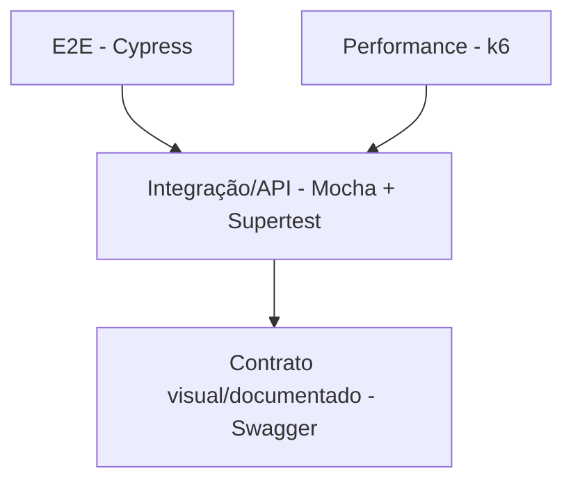

# QA - Estratégia de Testes

## Objetivo

Definir a estratégia de qualidade do **Forja de Heróis**, garantindo que os fluxos críticos de autenticação, missões e progressão sejam validados de forma automatizada e reproduzível.

---

## Escopo da estratégia

| Área | Cobertura |
| --- | --- |
| API | Registro, login, criação/listagem/atualização de missões |
| Interface | Login, cadastro, dashboard, ações de missão e logout |
| Performance | Login e criação de missão com k6 |
| Documentação | Swagger disponível e alinhado às rotas |
| Pipeline | Execução automatizada em GitHub Actions |

---

## Pirâmide de testes



---

## Critérios de entrada

| Critério | Status esperado |
| --- | --- |
| Backend instalável | `npm install` executado com sucesso |
| Frontend instalável | `npm install` executado com sucesso |
| Variáveis configuradas | `JWT_SECRET` disponível |
| API ativa | `http://localhost:4000` respondendo |
| Frontend ativo | `http://localhost:3000` respondendo |

---

## Tipos de teste

### Testes de API

Ferramentas:

- Mocha
- Chai
- Supertest

Comando:

```bash
cd backend
npm test
```

Coberturas atuais:

- Registro de usuário.
- Login com token JWT.
- Criação de missão.
- Atualização de missão para `in_progress`.
- Conclusão de missão com ganho de XP.
- Listagem de missões do usuário.

---

### Testes E2E

Ferramenta:

- Cypress

Comandos:

```bash
cd frontend
npm run cy:open
npm run cy:run
```

Coberturas atuais:

- Cadastro pela tela.
- Login com credenciais válidas.
- Exibição de erro em login inválido.
- Alternância entre login e registro.
- Criação de missão.
- Início de missão.
- Conclusão de missão.
- Exclusão de missão.
- Logout.

---

### Testes de performance

Ferramenta:

- k6

Scripts:

```bash
cd backend
npx k6 run k6/login.js
npx k6 run k6/create_mission.js
```

Objetivo:

- Validar comportamento básico da API em cenários repetidos.
- Identificar degradações em autenticação e criação de missões.

---

## Critérios de saída

| Critério | Esperado |
| --- | --- |
| API | Todos os testes Mocha aprovados |
| E2E | Fluxos Cypress críticos aprovados |
| Performance | Sem falhas HTTP relevantes nos cenários k6 |
| Documentação | Swagger acessível e rotas principais descritas |
| Build | Frontend gera build sem erro |

---

## Riscos conhecidos

| Risco | Impacto | Mitigação |
| --- | --- | --- |
| Persistência em JSON | Dados locais podem conflitar entre testes | Limpar banco antes/depois das suites |
| Cypress depende de backend ativo | E2E falha se API não estiver rodando | Documentar ordem de execução |
| Porta fixa no frontend | Falha se backend mudar de porta | Centralizar base URL por variável |
| Swagger pode divergir do código | Documentação incorreta | Revisar Swagger a cada alteração de rota |

---

## Páginas relacionadas

- [QA - Plano de Testes](QA-Plano-de-Testes)
- [API e Swagger](API-e-Swagger)
- [CI/CD e Ambientes](CI-CD-e-Ambientes)

